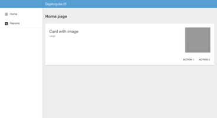
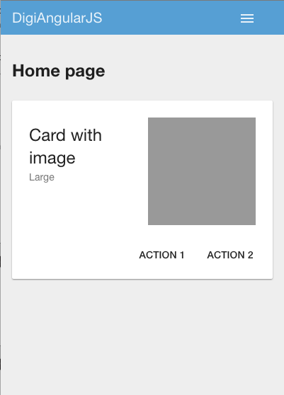
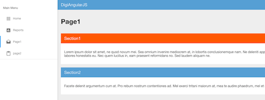

## Angular & Typescript Seed Project

Simple seed project using Angular 1.x (latest), Typescript, Gulp, and Jade. We are implementing best practices to ease the migration to Angular 2.x and especially dividing our apps in directives to approximate Angular 2’s component architecture.

##### Desktop View:



##### Mobile View:




#### Here are some of the concepts and tools we use:

* **Angularjs** as our backbone for a single page application.
* **Angular Material** providing UI component and a reference implementation of Google’s Material Design Specification.
* **Responsive Side Menu** that hides on mobile and small desktop screen. On mobile the menu icon is in the top right and on small desktop in the top left to comply to modern usability patterns.
* **Typescript** to prepare for the Angular 2 upgrade which is written in Typescript and to provide type safety (i.e. finding more errors at compile time.)
* **Organize the files in components** to avoid folders likes ‘controller’, ‘view’, and ‘model’ that include dozen of files and make it hard to work on a component as the developer finds herself switching between folders all the time.
* **Using Component Directives** to prepare for Angular 2 and to reduce the complexity of the app by creating our own HTML tags to have a very modular application.
* **Gulp** is a task runner to automate compiling Typescript files to Javascript, converting Jade templates to HTML, and dealing with dependencies to avoid human errors and long hours spent updating script tags.
* **Jade** as a templating tool as it more error-proof that you do not need closing tags and it looks cleaner. If this is too much of a learning curve, we often use a jade converter to teach and learn.
* **Typings** to bring TypeScript type definitions that enables a lot of features in editor to develop.
* **Bower** to manage all of our libraries, assets, etc.
* **Browsersync** to provide live reloads as you develop to cut out repetitive manual tasks.
* **mainBowerFiles** to automatically grab files (js & css) from our libraries and combine them into a vendor.js file and vendor.css files to simplify our includes.
Even if there are lots of tools and concepts, we try to keep it as simple as possible. This first post will look at describing the overall project and we will then explore some concepts and components in future articles.

### BEFORE THE INSTALL:
Check that you have npm, bower, and typings installed:
```bash
$ npm --version
$ bower --version
$ typings --version
```
### TO INSTALL:
To create the app, you need to download the libraries by calling npm install which will automatically call the other components (bower & typings as a postinstall script.) Then, you can invoke gulp serve to build and open the app.
```bash
$ npm install
```
### TO RUN
```bash
$ gulp serve
```
=======

Recommended Editor:
atom: https://atom.io/
* Theme: seti & monokai seti
* Plugins: angularjs, atom-beautify, atom-live-server, atom-toolbar, atom-typescript, close-tags, flex-tool-bar, git-plus, tool-bar, atom-jade
* Toolbar example: toolbar.cson

=======

### Files & Folders Overview


* bower.json: list of libraries used by our application.
* gulpfile.js: tasks to build and run our app.
* package.json: list of tools to create the app.
* src folder that contains our jade and ts files
* — app.ts: main app with the routing configuration
* — index.jade: main page
* — components:
* — — home: the main page brining the navigation and toolbar
* — — navigation: the leftnav and toolbar directives
* — — reports: a second page example
* — css/app.css: our custom styles
* toolbar.cson: example of a toolbar for Atom (see README.md)
* tsconfig.json: typescript configuration. The temporary files are created in .tmp to avoid mixing .js and .ts files together
* typings.json: Type definitions

======

### Main page and app in TypeScript and Jade

```jade
doctype html
html(lang="en", data-ng-app="digiangularjs")

  head
    meta(charset='utf-8')
    meta(name='viewport', content='width=device-width, initial-scale=1, maximum-scale=1')
    link(rel='stylesheet', href='css/vendor.css')
    link(rel='stylesheet', href='css/app.css')
  body(layout='column')
    div(ui-view='', layout='row', layout-fill='')
    script(src='js/vendor.js')
    script(src='js/app.js')
```

The main app list the modules we are using (e.g. Angular material) and define our navigation using a state concept

```typescript
/// <reference path="../typings/globals/jquery/index.d.ts" />
/// <reference path="../typings/globals/angular/index.d.ts" />
/// <reference path="../typings/globals/angular-material/index.d.ts"/>
/// <reference path="../typings/globals/angular-ui-router/index.d.ts"/>

module app {
  'use strict';
  console.log('app.ts ... started!');
  angular.module('digiangularjs', [
    'ui.router',
    'ngMaterial',
    'ngMdIcons',
    'digiangularjs.home',
    'digiangularjs.page1',
    'digiangularjs.page2',
  ])
(...)
    $urlRouterProvider.otherwise('/');

    //angular-ui-router for multiple views
    $stateProvider
      .state('home', {
        url: "/",
        templateUrl: 'components/home/home.html',
        controller: 'homeController',
        controllerAs: 'vm',
      })
      .state('home.reports', {
        url: '/reports/',
        templateUrl: 'components/reports/reports.html'
      })
      .state('home.page1', {
        url: '/page1/',
        templateUrl: 'components/page1/page1.html'
      })
      .state('home.page2', {
        url: '/page2/',
        templateUrl: 'components/page2/page2.html'
      })
      ;
    //more states here.
  }
}
```

Using directives, we can define new html tag like digi-leftnav to bring a side navigation and digi-toolbar that brings the top toolbar providing menu icons:

```typescript
digi-leftnav
div(layout='column', layout-fill='', ng-cloak='')
  digi-toolbar
  div(ui-view='', layout-padding='')
    h2 Home page
    md-card(md-theme="{{ showDarkTheme ? 'dark-grey' : 'default' }}", md-theme-watch='')
      md-card-title
        md-card-title-text
          span.md-headline Card with image
          span.md-subhead Large
        md-card-title-media
          .md-media-lg.card-media
      md-card-actions(layout='row', layout-align='end center')
        md-button Action 1
        md-button Action 2
```

At a high level, directives allows to create your own HTML tags, attributes, etc. We created application specific directives like our digi-toolbar and digi-leftnav. For instance, static HTML does not know how to create a navbar or datepicker; however, we can teach HTML those new elements using the directive syntax. This directive will create an element that creates a toolbar in our example below.

```jade
<digi-toolbar></digi-toolbar>
```

### How do we get that tag to generate our top toolbar?

#### Step 1

We create a toolbar.directive.ts:
```typescript
/// <reference path="../../../typings/angular-ui-router/angular-ui-router.d.ts"/>
/// <reference path="../../../typings/angular-material/angular-material.d.ts"/>

module DigiToolbar
{
    export class ToolbarDirective implements ng.IDirective
    {
        public restrict: string = "E";
        public replace: boolean = true;
        public templateUrl: string = 'components/navigation/toolbar.html';
        public controller = DigiToolbar.ToolbarController;
        public controllerAs: string = 'vm';
        public scope = {};
  }


    export class ToolbarController
    {
        static $inject = ['$mdSidenav'];
        public $mdSidenav: ng.material.ISidenavObject;
        constructor($mdSidenav: ng.material.ISidenavObject)
        {
          var vm = this;
          vm.$mdSidenav = $mdSidenav;
          console.log('ToolbarController ... started.');
        }
    }
}
```

#### Step 2

We define our jade template, so the custom tag will be replace by that content:
```jade
md-toolbar
  .md-toolbar-tools
    md-button(ng-click="vm.$mdSidenav('left').toggle()", hide-gt-md='', hide-xs='', aria-label='Menu')
      ng-md-icon(icon='menu')
    h3 DigiAngularJS
    span(flex='')
    md-menu
      md-button(aria-label='Open Menu', hide-gt-xs='', ng-click="vm.$mdSidenav('left').toggle()")
        ng-md-icon(icon='menu')
      md-menu-content(width='4')
```

#### Step 3

We define our new tag in our controller:
```typescript
/// <reference path="../../../typings/angularjs/angular.d.ts" />
/// <reference path="../../../typings/angular-material/angular-material.d.ts"/>

class HomeController {
    static $inject = ['$mdSidenav'];
    public $mdSidenav: ng.material.ISidenavObject;

    constructor($mdSidenav: ng.material.ISidenavObject) {
        console.log("home.controller constructor");
        this.$mdSidenav = $mdSidenav;
    }
}

angular
    .module('digiangularjs.home', ['ngMaterial'])
    .controller('homeController', HomeController)
    .directive("digiLeftnav", [() => new DigiLeftNav.LeftNavDirective()])
    .directive("digiToolbar", [() => new DigiToolbar.ToolbarDirective()])
```


In our home controller we are defining ```digi-leftnav``` and ```digi-toolbar``` by calling the associated directives.

=======
### Sample pages with shared directives

You can use directives to share content and features between multiple pages of your applications. For instance we are going to have two pages that share two section of contents.




Our first page looks like (page1/page1.ts):
```jade
h1 Page1
page1-section1
page1-section2
```

And, in our second page, we just display the same sections in a different order (page2/page2.ts):
```jade
h1 Page2
page2-section2
page2-section1
```


Our controllers are very similar and mainly instantiate the directives section1 and section2:
```typescript
class Page1Controller {
    static $inject = [];
    constructor() {
        console.log("Custom Page1Controller ...");
    }
}

angular
    .module('digiangularjs.page1', [])
    .controller('agendaController', Page1Controller)
    .directive("page1Section1", [() => new DigiSection1.Section1Directive()])
    .directive("page1Section2", [() => new DigiSection2.Section2Directive()])
;
```

Our controller for the second page is similar, but we change the names of the directive tags to avoid conflicts:
```typescript
angular
.module('digiangularjs.page2', [])
    .controller('page2Controller', Page2Controller)
    .directive("page2Section1", [() => new DigiSection1.Section1Directive()])
    .directive("page2Section2", [() => new DigiSection2.Section2Directive()])
    ;
```

So, the same section will appear using the tag in our first page and in our second page.

This is what our section directive looks like:

```typescript
module DigiSection1 {
  export class Section1Directive implements ng.IDirective {
    public restrict: string = "E";
    public replace: boolean = true;
    public templateUrl: string = 'components/page1/section1.html';
    public controller = DigiSection1.Section1Controller;
    public controllerAs: string = 'vm';
    public scope = {
    };
    public bindToController: boolean = true;
  }


    export interface ISection1Scope extends ng.IScope {
      // properties for isolated scope
    }

  export class Section1Controller {
    static $inject = ["$scope"];

    constructor(protected $scope: DigiSection1.ISection1Scope) {
      console.log('Section1Controller constructor ...');
    }
  }
}
```

We will add example of how to get state, attribute information, and a share service library, but right now this is just displaying a debug message to show that it is called. Our template section1.jade is defined as below:

```jade
div(layout='column', ng-cloak='')
  md-toolbar.md-warn
    .md-toolbar-tools
      h2.md-flex Section1
  md-content(flex='', layout-padding='')
    p
      | Lorem ipsum dolor sit amet, ne quod novum mei. Sea omnium invenire mediocrem at, in lobortis conclusionemque nam. Ne deleniti appetere reprimique pro, inani labitur disputationi te sed. At vix sale omnesque, id pro labitur reformidans accommodare, cum labores honestatis eu. Nec quem lucilius in, eam praesent reformidans no. Sed laudem aliquam ne.
```
For the section2, we have something similar with different colors and contents.
